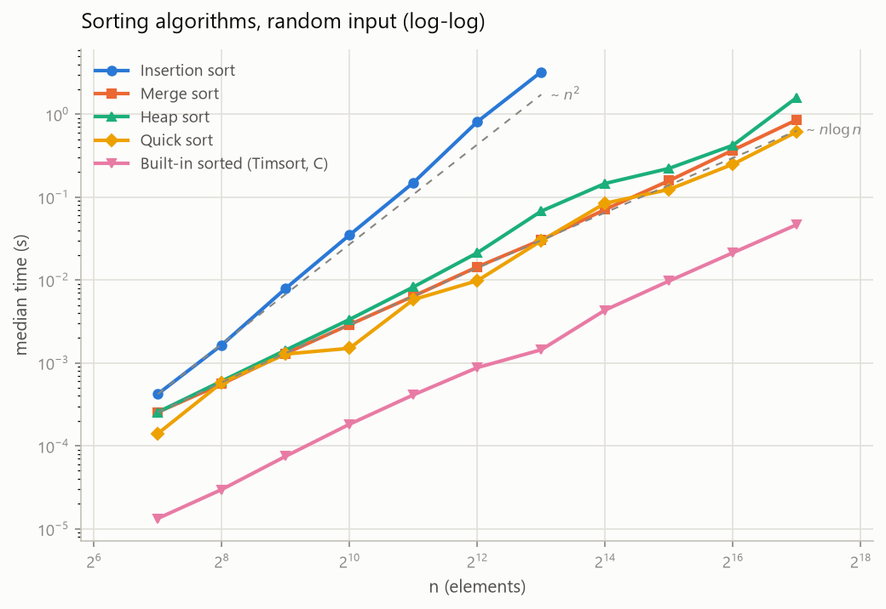
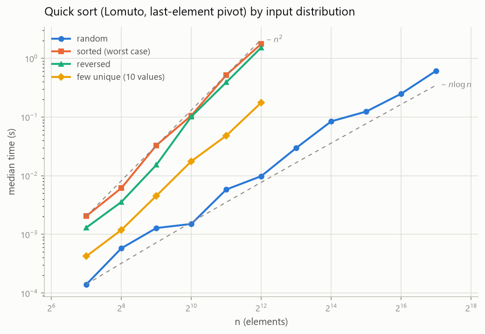

# Algorithm Analysis

> Classic algorithms implemented from scratch in Python: tested, measured, and analyzed.

[](https://github.com/terencechou1022/Algorithm_Analysis/actions/workflows/ci.yml)

這個專案從零開始實作經典演算法，並逐步擴充為完整的實作與分析專案。我的大學本科不是資訊領域，所以我選擇讓程式碼自己說話：每一個演算法都有正確性測試、理論複雜度說明，接下來還會加上實測數據與理論的對照分析。

## 收錄內容

| 演算法 | 分類 | 平均時間 | 最壞時間 | 額外空間 | 原始碼 |
|--------|------|----------|----------|----------|--------|
| 插入排序 Insertion Sort | 排序 | O(n²) | O(n²) | O(1) | [sorting.py](src/algorithms/sorting.py) |
| 合併排序 Merge Sort | 排序 | O(n log n) | O(n log n) | O(n) | [sorting.py](src/algorithms/sorting.py) |
| 堆積排序 Heap Sort | 排序 | O(n log n) | O(n log n) | O(log n)¹ | [sorting.py](src/algorithms/sorting.py) |
| 快速排序 Quick Sort | 排序 | O(n log n) | O(n²)² | O(log n) | [sorting.py](src/algorithms/sorting.py) |
| 霍夫曼編碼 Huffman Coding | 貪婪 | O(n + k log k) | O(n + k log k) | O(k) | [huffman.py](src/algorithms/huffman.py) |
| 最長共同子序列 LCS | 動態規劃 | O(mn) | O(mn) | O(mn) | [lcs.py](src/algorithms/lcs.py) |

¹ 本實作的 heapify 為遞迴版本，呼叫堆疊深度 O(log n)。
² 採 CLRS 的 Lomuto 分割（固定取尾端元素當樞軸），已排序輸入會退化為 O(n²)。這是刻意保留的教科書行為，之後會在效能分析中實測這條退化曲線。

## 快速開始

```bash
git clone https://github.com/terencechou1022/Algorithm_Analysis.git
cd Algorithm_Analysis
pip install -e ".[dev]"
pytest
```

```python
from algorithms import quick_sort
from algorithms.huffman import build_freq_map, build_huffman_tree, generate_huffman_codes
from algorithms.lcs import lcs

quick_sort([5, 2, 8, 4, 9, 1])   # [1, 2, 4, 5, 8, 9]
lcs("ABCBDAB", "BDCABA")         # (4, 'BCBA')

codes = generate_huffman_codes(build_huffman_tree(build_freq_map("aaabbc")))
```

## 效能實測分析

完整方法論與解讀在 [docs/analysis.md](docs/analysis.md)，數據與腳本在 [benchmarks/](benchmarks/)。兩個代表性結果：



四種手寫排序與內建 `sorted()` 的實測曲線（log-log）：merge、heap、quick 的斜率貼合 n log n 參考線，insertion 貼合 n²；C 實作的 Timsort 比最快的手寫排序仍快一個數量級。



同一份 quick sort 程式碼，只改輸入分佈：已排序輸入退化為 O(n²)，4,096 筆資料比隨機輸入慢 180 倍。理論上的最壞情況，實測看得見。

## 測試怎麼寫

- 四種排序：與 Python 內建 `sorted()` 對照，涵蓋空列表、單一元素、全重複、已排序、反向、負數、浮點數，以及固定 seed 的隨機案例
- LCS：CLRS 書中案例之外，另以隨機字串與暴力解（列舉全部子序列）對照長度，並驗證回傳字串確實是共同子序列
- 霍夫曼：驗證編碼再解碼可完整還原、前綴碼性質、示範頻率表的加權編碼長度，以及單一字元與空輸入的退化情況

## 專案結構

```
src/algorithms/    # 演算法本體（安裝為 Python 套件）
tests/             # pytest 測試
benchmarks/        # 效能量測與繪圖腳本、實測數據 CSV
docs/              # 分析文件與效能圖表
.github/workflows/ # CI：ruff 靜態檢查 + pytest
```

## 後續規劃

- [x] 效能實測：多種輸入規模與分佈的 benchmark，理論 vs 實測曲線分析（[docs/analysis.md](docs/analysis.md)）
- [ ] huffzip：以霍夫曼編碼實作、能壓縮真實檔案的 CLI 工具
- [ ] minidiff：以 LCS 實作的檔案差異比較工具
