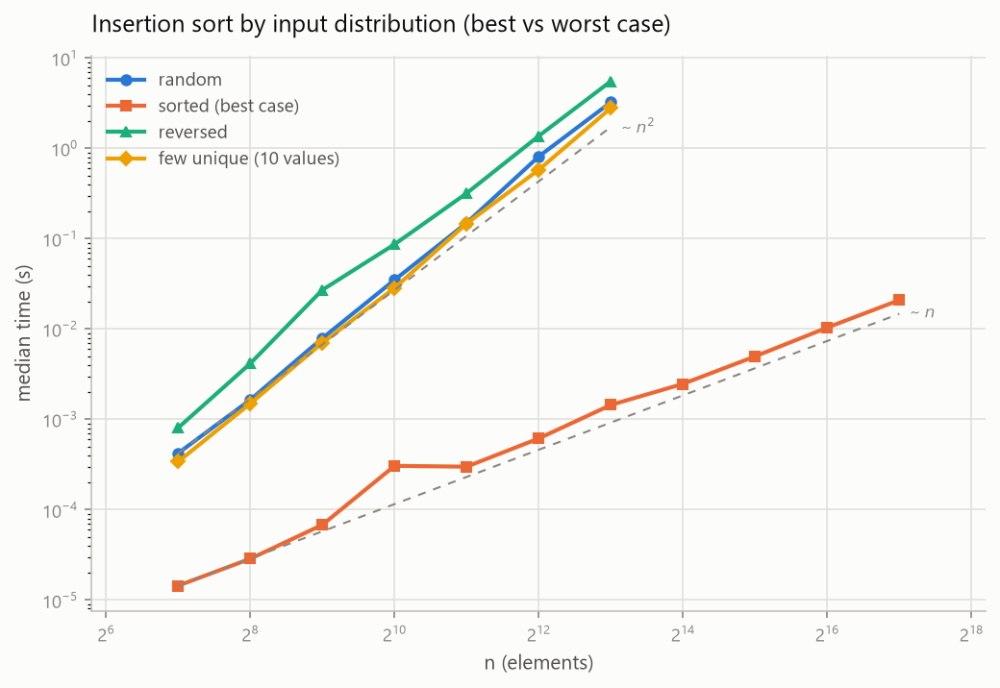
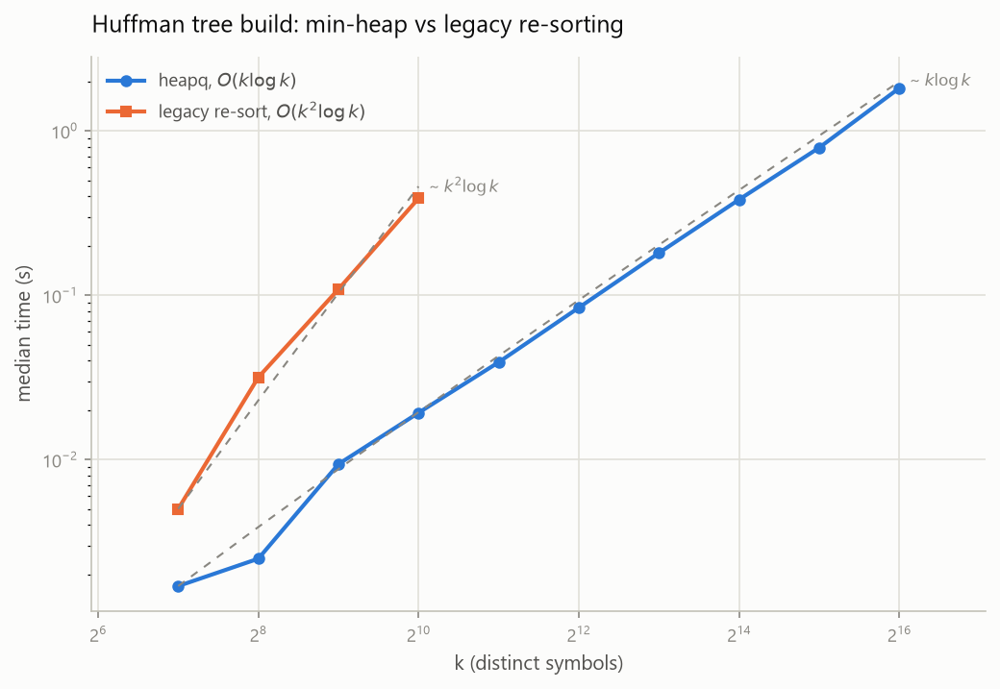

# 理論 vs 實測：效能分析

數據由 [benchmarks/run_benchmarks.py](../benchmarks/run_benchmarks.py) 產生，圖由 [benchmarks/plot_results.py](../benchmarks/plot_results.py) 繪製。本文所有數字都在 [benchmarks/results/](../benchmarks/results/) 的 CSV 中，照腳本重跑即可重現。

## 量測方法

- 計時器用 `time.perf_counter`，複製輸入列表的成本排除在計時之外
- 排序每個資料點計時 5 次取中位數，霍夫曼 3 次。中位數比平均值更能抵抗背景程序造成的毛刺
- 輸入以固定 seed 產生，重跑會得到同一批輸入
- 座標軸取 log-log：冪次關係在圖上呈直線，斜率即冪次（O(n²) 斜率 2、O(n) 斜率 1、O(n log n) 略高於 1）。虛線是理論參考線，縮放到通過各序列的第一個實測點，看斜率不看常數
- 量測環境記錄於 [benchmarks/results/environment.txt](../benchmarks/results/environment.txt)（Windows 11、Python 3.12.10）

## 排序：隨機輸入下的四條曲線

| 演算法 | n=131,072 中位數 | 理論 |
|--------|------------------|------|
| 內建 sorted()（Timsort，C 實作） | 0.047 s | O(n log n) |
| quick sort | 0.61 s | 平均 O(n log n) |
| merge sort | 0.86 s | O(n log n) |
| heap sort | 1.59 s | O(n log n) |
| insertion sort | 3.2 s（n=8,192 時） | O(n²) |

1. **斜率與理論吻合。** merge、heap、quick 貼著 n log n 參考線；insertion 貼著 n²，n 每倍增、時間約成長 4 倍（0.81 s → 3.2 s），這是 O(n²) 的簽名。若讓 insertion 跑完 131,072 筆，外插約需 14 分鐘，因此其量測上限設在 8,192。
2. **同為 O(n log n)，常數因子差 2.6 倍。** quick（0.61 s）與 heap（1.59 s）漸進相同，但 heap sort 的父子節點索引相距一倍遠，快取局部性差；merge 順序掃描，居中。複雜度只描述成長率，沒描述常數。
3. **「小 n 時 insertion sort 較快」在本量測範圍內不成立。** n=128 的隨機輸入下 insertion（0.42 ms）已輸給 merge（0.25 ms）。它真正的優勢在幾乎已排序的輸入（見下文）。教科書的經驗法則要靠量測驗證，不能背誦。
4. **Timsort 比最快的手寫排序快 13 倍。** 演算法量級相同時，實作語言（C 對 Python 直譯）與演算法工程（run 偵測、galloping merge）決定了這一個數量級。懂理論之後，實務上仍應優先用內建函式。

## Quick sort 的退化：同一份程式碼，輸入決定行為

Lomuto 分割固定取最後一個元素當樞軸。輸入已排序時，每次分割都是最不平均的 (n-1, 0)，時間退化為 O(n²)、遞迴深度退化為 O(n)：

| 輸入分佈（n=4,096） | 中位數 | 相對隨機輸入 |
|---------------------|--------|--------------|
| 隨機 | 0.0098 s | 1× |
| 高重複（10 種相異值） | 0.18 s | 18× |
| 反序 | 1.53 s | 156× |
| 已排序 | 1.77 s | 180× |

- 已排序與反序的曲線斜率貼合 n²；隨機輸入貼合 n log n。
- 高重複輸入介於中間：Lomuto 把等於樞軸的元素全放同一側，重複值越多、分割越不平均。
- 遞迴深度是真實的工程限制：Python 預設遞迴上限 1,000，已排序輸入 n=4,096 需先把上限調高才能跑完（benchmark 內設為 20,000）。CPython 沒有尾遞迴優化，過深的遞迴另有 C 堆疊溢位風險，因此退化情境只測到 4,096。
- 這正是實務實作（introsort、隨機樞軸、三數取中）存在的理由：不是讓平均更快，而是把最壞情況擋掉。

## Insertion sort 的兩面：O(n) 最佳情況與 O(n²) 最壞情況

- **已排序輸入是 O(n)。** 內層 while 迴圈一次都不執行，131,072 筆只要 21 ms，比 merge sort 處理同樣輸入（433 ms）快 20 倍。
- **反序是最壞情況。** 每個元素都要搬到最前面，n=8,192 時 5.55 s，約為隨機輸入（3.25 s）的 1.7 倍，與理論比值 2（搬移次數 n²/2 對 n²/4）方向一致。
- 「幾乎已排序的資料」是 insertion sort 的實戰場景；Timsort 在短 run 內部用的正是插入排序。

## Huffman 建樹：一次真實的複雜度改進

重構前的版本（Initial commit）每合併一次就把整個節點列表重新排序，總複雜度 O(k² log k)；重構後改用 `heapq` 最小堆積，O(k log k)。同一台機器、同一批頻率表：

| k（相異符號數） | 舊版 | heapq 版 | 加速 |
|-----------------|------|----------|------|
| 128 | 5.0 ms | 1.7 ms | 3× |
| 512 | 109 ms | 9.4 ms | 12× |
| 1,024 | 389 ms | 19 ms | 20× |
| 65,536 | 未實測（外插約 40 分鐘） | 1.8 s | |

差距隨 k 擴大：k=128 時只差 3 倍，k=1,024 已差 20 倍。這就是漸進複雜度的意義：常數層面的優化救不了成長率。

## 量測的限制

這份數據不能說明的事，一併列出：

- 桌機背景負載未隔離、未鎖 CPU 頻率。中位數抑制了毛刺，但小於 1 ms 的資料點受計時解析度影響較大，曲線左端較毛躁
- 單一 seed 家族、單執行緒。目的是驗證漸進趨勢與相對關係，不是嚴謹的微基準
- CI 不重跑 benchmark（雲端環境每次不同，數據無可比性）。圖與 CSV 由本機產生後納入版控，環境記錄於 environment.txt
- Python 直譯器的常數開銷放大了絕對時間。相對關係（斜率、倍率）才是本文重點
